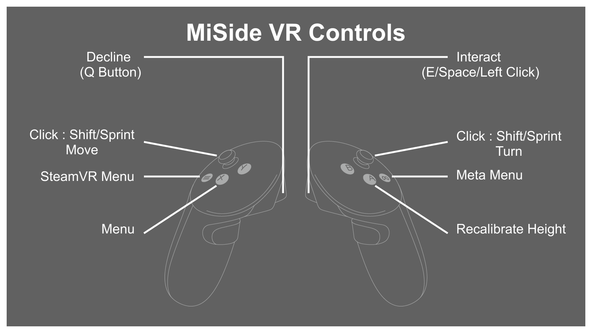

  

  
  
  </a>
  
  

MiSide VR is a mod which makes [MiSide](https://store.steampowered.com/app/2527500/MiSide/) fully playable in VR with full 6DoF support!

Features
========
- Full 6DoF headset and controller tracking.
- Roomscale movement and physical turning. (WIP)
- Configurable snap and smooth turning.
- IK support (WIP)
- All effects rendered in VR.
- Minigames playable in VR with controllers.
- Left-handed mode and height calibration.
- Work in progress, but most of the game is playable in VR.

How to use
==========

### Installation

The default game folder is `C:\Program Files (x86)\Steam\steamapps\common\MiSide`, you may also find your installation via `Steam` -> `Manage` -> `Browse local files`.

1. Download and install [BepInEx 6.0.0-pre.2](https://github.com/BepInEx/BepInEx/releases/download/v6.0.0-pre.2/BepInEx-Unity.IL2CPP-win-x64-6.0.0-pre.2.zip) into the game folder.
2. Launch the game once, then close it so BepInEx can create its files.
3. Download the latest release from [Nexus Mods](https://www.nexusmods.com/miside/mods/788) and extract it into the MiSide folder.
4. Start SteamVR and connect your headset.
5. Launch MiSide normally.

The mod requires SteamVR to be open before the game.

### Controls

  

Note: Only Quest 3 mappings have been tested.

Left handed mode, turning style, and other options can be changed in:
`BepInEx/config/com.Glitchtest51.MiSide_VR.cfg`

This mod still contains many bugs, please report any bugs when encountered.

Known Bugs
==========
- SpaceCar UI does not spin with the camera
- Ghost Mita Gluing is offset
- VRIK bones are not perfect
- Please report more in the [Discord](https://discord.gg/EcGQUTBVda) or in [GitHub Issues](https://github.com/Glitchtest51/MiSide_VR/issues)

Contributions and Donations
===========================

Bug reports, feedback, and pull requests are all welcome.
Please check for existing issues before opening a new one. Pull requests should explain what have you changed, what did you test after changing, and what do these changes fix/affect.

If you like what i'm doing, feel free to donate on [Ko-fi](https://ko-fi.com/glitchtest) or consider giving it a star! It helps support the project or any future projects I may make!

License
=====
This Project is licensed under the terms of the GNU General Public License v3.0.

You can find a copy of the license in the [LICENSE file](LICENSE).

Credits
=======
MiSide VR is developed and maintained by [@Glitchtest51](https://github.com/Glitchtest51).

This project would not have been possible without the work, support, and contributions of:
- [iPowerTech](https://github.com/iPowerTech) for [SonsVR_Mod](https://github.com/iPowerTech/SonsVR_Mod).
- [DSprtn](https://github.com/DSprtn) for [SteamVR_Standalone_IL2CPP](https://github.com/DSprtn/SteamVR_Standalone_IL2CPP), the [GTFO VR Plugin](https://github.com/DSprtn/GTFO_VR_Plugin), and the [GTFO VR postmortem](https://dsprtn.dev/posts/GTFO-VR-Postmortem/).
- [PureDark](https://github.com/PureDark) for [SteamVR_Standalone_IL2CPP](https://github.com/PureDark/SteamVR_Standalone_IL2CPP/tree/MiSide) and [GunfireRebornVRMod](https://github.com/PureDark/GunfireRebornVRMod).
- [Raicuparta](https://github.com/Raicuparta) for [heaven-vr](https://github.com/Raicuparta/heaven-vr).
- [CamelCaseName](https://github.com/CamelCaseName) for [HPVR](https://github.com/CamelCaseName/HPVR) and [SteamVR_Melon](https://github.com/CamelCaseName/SteamVR_Melon).
- [CircuitLord](https://github.com/CircuitLord) for [Big Walk VR](https://github.com/CircuitLord/BigWalkVRInstaller).
- [Valve](https://github.com/ValveSoftware) for [OpenVR](https://github.com/ValveSoftware/openvr) and the [SteamVR Unity Plugin](https://github.com/ValveSoftware/steamvr_unity_plugin).
- [Elliot Tate](https://github.com/elliotttate) for [MelonMCP](https://github.com/elliotttate/MelonMCP).
- [sinai-dev](https://github.com/sinai-dev) for [UnityExplorer](https://github.com/sinai-dev/UnityExplorer).
- [Hack Club Stardance](https://stardance.hackclub.com/).
- Members of the [Flat2VR](https://flat2vr.com/), [MelonLoader](https://melonwiki.xyz/), and [BepInEx](https://github.com/BepInEx/BepInEx) Discord servers for help making this project possible!
- Members of the [MiSide Discord server](https://discord.com/servers/miside-508309955686957057) for supporting me along the way! :>